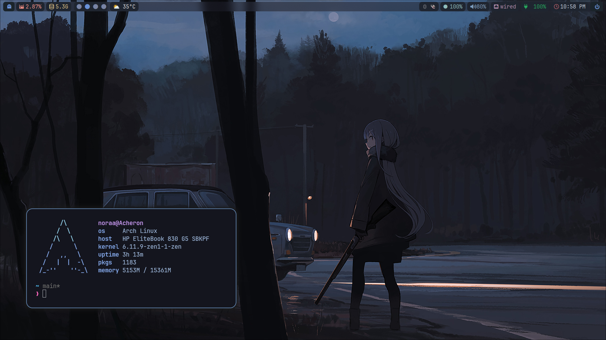
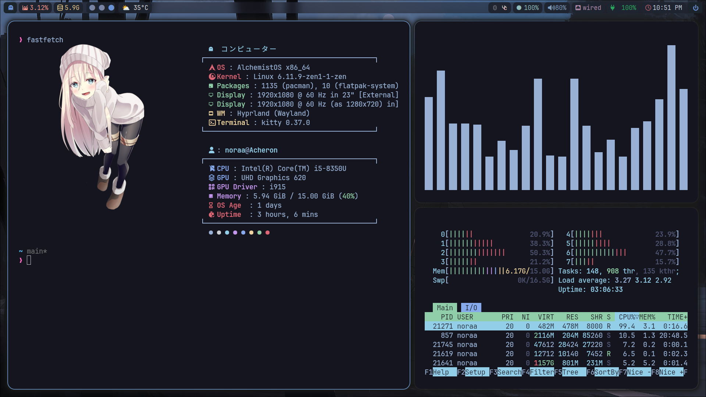

<div align="center">

</div>
<div align="center">
    <h3>🔮 noraainuse Dotfiles 🔮</h3>
    
</div>

# Gallery 📷



# Contents 📚:
### **☘ Don't copy all setup , Use at your own risk :3**
### Overview 🎑

- [🌳 Windows Manager]:
  - [🍚 HyprLand](https://hyprland.org/)
- [🔳 Terminal]:
  - [Kitty 🐈‍⬛](https://sw.kovidgoyal.net/kitty/)
  - [Alacritty 🗻](https://alacritty.org/)
- [🌌 Shell](#shell): 
    - [Oh My Zsh](https://ohmyz.sh/#install)
    - **Plugin Manager**: [Zap](https://www.zapzsh.org/)
    - **🤖 Prompt**: [Powerlevel10k Prompt (˶˃ ᵕ ˂˶)](https://github.com/romkatv/powerlevel10k)
# Installations 💫:
- This config need first [Hyprland](https://hyprland.org/) using this [guide](https://wiki.hyprland.org/Getting-Started/Installation/) depend on your Distro:

### Arch

```zsh
  yay -S hyprland-git
  ```
### Ubuntu / Debian
```zsh
sudo apt install hyprland
```
### Fedora
```zsh
sudo dnf install hyprland
sudo dnf install hyprland-devel
```
### Base setups (💻):

- Install waybar, Rofi, Dunst, kitty terminal, swaybg, swaylock-fancy, swayidle, pamixer, light, Brillo:

```
yay -S waybar rofi dunst kitty swaybg swaylock-fancy-git swayidle pamixer light brillo 
```
### Other Distro Dependents on your packages manager
- Example : dnf , apt , xbps

### Necessary Font 🔑:

- [JetBrains Mono Nerd Font](https://github.com/ryanoasis/nerd-fonts/releases/download/v2.2.2/JetBrainsMono.zip)
  ```zsh
  yay -S ttf-jetbrains-mono-nerd
  ```

- [Iosevka Nerd Font](https://github.com/ryanoasis/nerd-fonts/releases/download/v2.3.3/Iosevka.zip)
  ```zsh
  yay -S ttf-iosevka ttf-iosevka-nerd
  ```

- [Font Awesome](https://archlinux.org/packages/community/any/ttf-font-awesome/)
  ```zsh
  yay -S ttf-font-awesome
  ```
  Once you download them and unpack them, place them into `~/.fonts` or `~/.local/share/fonts.`
Then run this command for your system to detect the newly installed fonts.

```
fc-cache -fv
```
### Clone Dotfiles 🌙:
```
git clone https://github.com/noraainuse/dotfiles
cd dotfiles
cp -r .config/* ~/.config/
```
  > Finally , now you can login with ํYour New Hyprland Rice


### Congratulations , at this point you successfully have installed Hyprland Your new Rice ✨🌙


[](https://star-history.com/#noraainuse/dotfiles&Timeline)
